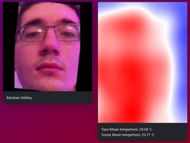

# Face Recognition Web App with Thermal Verification

### Keywords
flask, socket.io, deepface, multiprocessing, opencv, face recognition, sqlite

## About
Face recognition system using edge computing on Raspberry Pi and a remote server. I have used Flask as my backend and deepface library for face embeddings and detection.

## Screenshots
### Assembly

### Web App

### Thermal Image Processing

## Raspberry Pi
I used official PiCam v2 NoIR camera with picamera2 python library. For thermal camera I used mlx9060 with adafruit libraries.

### Specs

Linux raspberrypi 6.1.0-rpi6-rpi-v8 #1 SMP PREEMPT Debian 1:6.1.58-1+rpt2 (2023-10-27) aarch64 GNU/Linux

